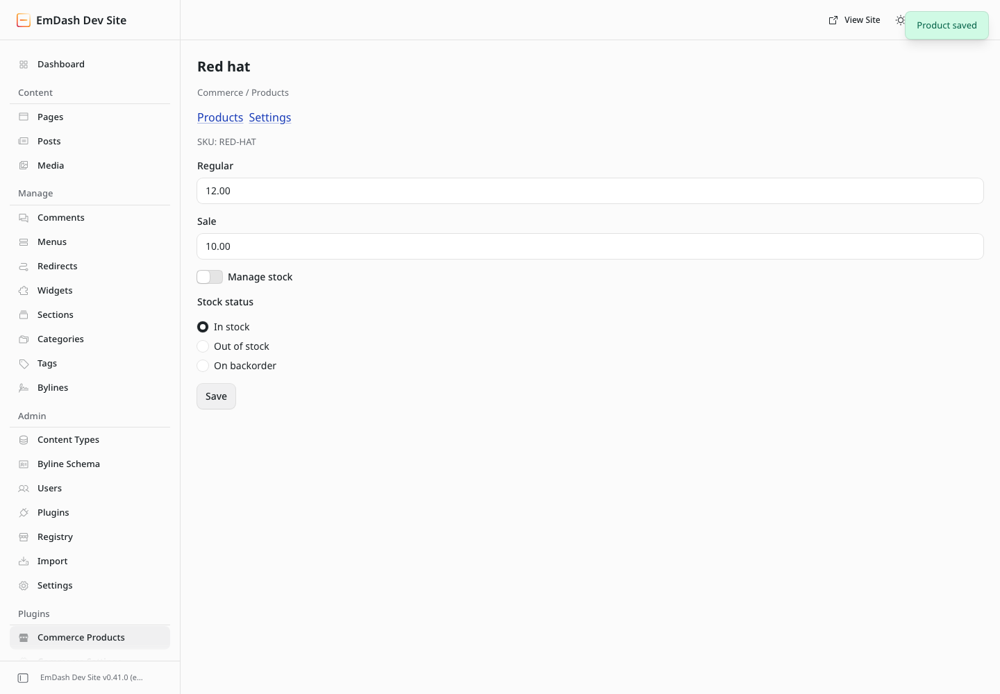
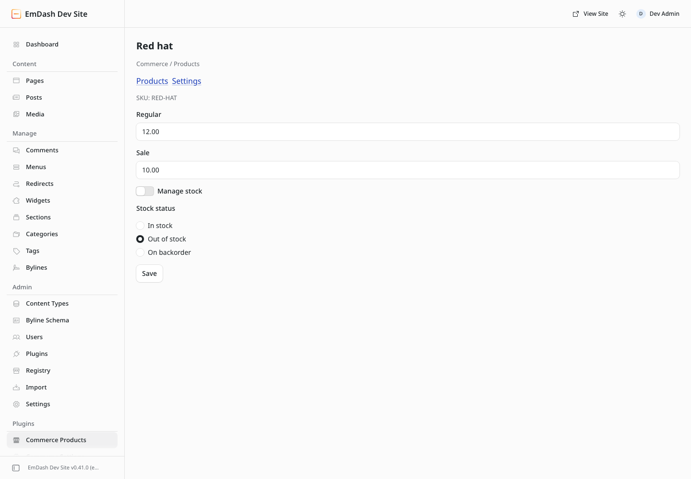
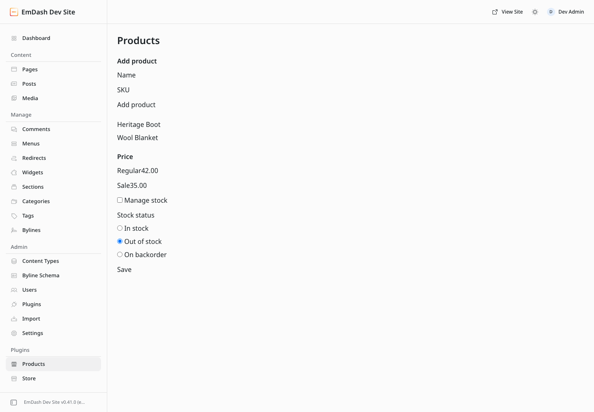

# Sandbox selected-stock-status repair — 2026-09-30

Before production source: `5cde2b574a06db40249a2e609673f6a3d92a09b8`.
After production source and harness: [source-sha256.txt](source-sha256.txt), bound
by the commit containing this packet. Historical native repair proof remains
unchanged. [Before source hashes](before-source-sha256.txt) bind the failure to
the original handler and the same new sandbox regression harness used after.

## Real runtime, before and after

Both runs use the repository's real EmDash **0.41.0** host, workerd sandbox,
Block Kit renderer, and new SQLite fixture. Synthetic Red hat starts manually
Out of stock, is managed, then management is disabled and In stock selected.
One Save submits prices and the chosen stock status.

| Evidence | Before repair | After repair |
|---|---|---|
| Submitted status | in-stock | in-stock |
| Save response | Product saved | Product saved |
| Persisted SQLite status | out-of-stock | in-stock |
| Assertion | failed, exit 1 | passed, exit 0 |

[Before request/result](sandbox-before.json) and
[after request/result](sandbox-after.json) are captured directly by the test
from the actual POST's form values, host response toast and SQLite read.
Only the synthetic fixture label, transport, form values, toast and manual
status are retained; generated product IDs and host paths are omitted.
These are selected observations, not database exports.

[Failing assertion](regression-before.txt) and
[passing browser transcript](regression-after.txt) preserve the red/green result.
The passing test reloads and reopens the product and asserts In stock. It then
restores a dormant Out of stock fixture and verifies both untouched form Save
and a real API request omitting stockStatus restore it; management enablement
does not overwrite dormant availability. Prices and absence of managed claims
remain asserted. The original storage-error, retry, settings and anonymous
access controls also pass.

## Native compatibility regression

The same fresh run proves the existing populated native React fixture. An
explicit Out of stock choice and Regular 42 / Sale 35 survive one Save and
reload. Product switching cannot leak unsaved intent; a disable with no new
choice restores dormant Out of stock; clicking an already-selected In stock
default remains explicit. [Native captured receipt](native-after.json).

These native controls are the retained compatibility renderer, including its
existing unstyled appearance in this fixture; this packet does not claim a
visual redesign or native-to-sandbox data migration.

## Validation and inspection

[Validation transcript](validation.txt): production/sandbox builds, **125 unit
and 20 integration tests**, and typecheck pass. **3 browser tests pass**, including
sandbox workflow, populated native regression, and unauthenticated native denial.
The before browser case fails exactly at persisted status. All five screenshots
were directly inspected: synthetic products only, visible selected controls,
no secrets, customer data, private repository coordinates or authenticated URLs.
[Evidence hashes](assets-sha256.txt) identify the exact unedited captures and
selected transcripts. This packet is committed in the same public repository
for inspection; ignored raw logs/screenshots alone are not the acceptance evidence.

The host logs one uncontrolled FieldControl default-value warning in the
passing sandbox fixture. It is retained in the public transcript; the stock
selection/reload/storage assertions pass. It is not an inventory or save error.

Scope remains the existing single-Save lock `block-admin-save-001`. The sandbox
submits the actual dormant initial value unless changed; the native page tracks
intent separately because its displayed managed default differs from dormant
status. Both preserve explicit choices and omission-based kernel restoration.
No kernel, Inventory provider, checkout PR #29, main branch, deployment or
package publication changes are part of this repair. This is local synthetic
runtime proof, not Registry install/discovery, EmDash 1.0, live Inventory/Stripe
or populated native-to-sandbox migration proof. Formal current-source review
and merge qualification remain with the assigned review owner.
